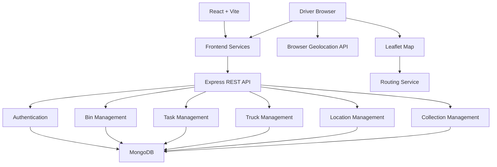

# ♻️ Smart Waste Collection System

> A full-stack web application for managing waste bins, collection tasks, trucks, drivers, locations, and map-based waste collection workflows.


---

## 📌 Overview

**Smart Waste Collection System** is a full-stack web application designed to support municipal waste collection workflows.

The system provides separate administrative and driver-oriented workflows for managing waste bins, collection operations, trucks, users, locations, and collection tasks.

The application combines:

* Waste-bin management
* Driver and truck management
* Collection task management
* Location tracking
* Interactive maps
* Geographic distance calculation
* Route visualization
* Authentication and protected application areas
* REST API communication
* MongoDB persistence
* Browser-based geolocation

Driver location updates are obtained through the browser's **Geolocation API** and communicated through the application's REST APIs. The project does not use WebSockets or Socket.IO for location communication.

> **Project status:** The application is currently intended for development, demonstration, and academic/project evaluation.

---

# ✨ Features

## 👨‍💼 Administrative Management

The frontend contains dedicated administrative pages and services for managing the waste collection system.

Current project structure includes functionality for:

* Administrator management
* User management
* Waste-bin management
* Collection management
* Truck management
* Location management
* Administrative map views
* Dashboard views
* Protected application routes
* Request/error state handling

---

## 🚛 Driver & Truck Management

The system includes dedicated driver and truck workflows.

The frontend contains:

* Driver dashboard
* Truck-driver dashboard
* Task-related services
* Truck-related services
* Location-related services
* Collection workflow services
* Map-based interfaces
* Distance calculation utilities

The driver workflow is designed around assigned collection work, current location, pickup locations, routing, and collection status.

---

## 🗑️ Waste-Bin Management

The system provides frontend and backend components for managing waste bins.

The project contains:

* Bin management pages
* Bin map components
* Bin service
* Bin controller
* Bin routes
* `Bin` Mongoose model
* Bin-fill simulation job

The backend also contains:

```text
server/src/jobs/binFillSimulator.js
```

which supports the project's bin-fill simulation functionality.

---

## 🗺️ Maps & Location

The application uses:

* **Leaflet** for interactive maps
* **OpenStreetMap** for map data
* **Browser Geolocation API** for obtaining the driver's location
* Geographic distance calculations
* Routing-related frontend services/utilities

### Driver Location Workflow

The location workflow is based on browser geolocation and REST communication:

```text
Driver opens dashboard
        │
        ▼
Browser requests location permission
        │
        ▼
navigator.geolocation.watchPosition()
        │
        ▼
Current latitude / longitude
        │
        ├───────────────┐
        ▼               ▼
Distance calculation   Map update
        │
        ▼
Frontend REST API
        │
        ▼
Backend location / truck operations
```

Location updates therefore do **not** depend on WebSockets or Socket.IO.

---

# 🏗️ Architecture

The system follows a client-server architecture.



### Architecture Flow

```text
React + Vite
     │
     ▼
Frontend Services
     │
     ▼
Express REST API
     │
     ├── Authentication
     ├── Bin Management
     ├── Task Management
     ├── Truck Management
     ├── Location Management
     └── Collection Management
              │
              ▼
           MongoDB
```

For driver-side mapping:

```text
Driver Browser
     │
     ├── Geolocation API
     ├── Leaflet Map
     └── Routing Service
```

---

# 🔄 Application Workflow

## Administrative Workflow

```text
Administrator
     │
     ▼
Authentication
     │
     ▼
Admin Dashboard
     │
     ├── Manage Bins
     ├── Manage Users
     ├── Manage Trucks
     ├── Manage Locations
     ├── Manage Collection Operations
     └── View Map Information
```

## Driver Workflow

```text
Driver
  │
  ▼
Authentication
  │
  ▼
Driver Dashboard
  │
  ▼
Load Collection / Task Information
  │
  ▼
Obtain Browser GPS Location
  │
  ▼
Display Location on Map
  │
  ▼
Calculate Relevant Distances
  │
  ▼
Route / Navigate to Collection Point
  │
  ▼
Perform Collection Workflow
  │
  ▼
Update Collection / Location Information
```

The exact behavior of individual workflow steps depends on the corresponding frontend services and backend controllers.

---

# 🧰 Technology Stack

| Layer              | Technology                          |
| ------------------ | ----------------------------------- |
| Frontend           | React                               |
| Build Tool         | Vite                                |
| Language           | JavaScript                          |
| Styling            | CSS                                 |
| Maps               | Leaflet                             |
| Map Data           | OpenStreetMap                       |
| Backend Runtime    | Node.js                             |
| API Framework      | Express.js                          |
| Database           | MongoDB                             |
| ODM                | Mongoose                            |
| Authentication     | Project authentication middleware   |
| Location           | Browser Geolocation API             |
| HTTP Communication | REST APIs                           |
| Routing            | Routing service / routing utilities |

### Important

The current project documentation does **not** list Tailwind CSS because its usage cannot be confirmed from the supplied project structure.

Likewise, the architecture does **not** include Socket.IO, WebSockets, or another dedicated real-time communication layer.

---

# ▶️ Running the Project

The repository contains independent frontend and backend applications:

```text
client/
server/
```

Both contain their own `package.json`.

Before running the project, install dependencies in each directory:

### Frontend

```bash
cd client
npm install
```

### Backend

```bash
cd server
npm install
```

The exact development/start/test commands should be taken from the corresponding `package.json` scripts.

> The supplied README material does not include the contents of either `package.json`, so no npm script names are assumed here.

---

# 🛡️ Security

## Currently Implemented

The repository contains dedicated components for:

* Authentication
* Authentication middleware
* Protected frontend routes
* Input validation utilities
* Centralized backend error handling
* Password-reset functionality
* User management

Relevant backend components include:

```text
server/src/middleware/auth.js
server/src/middleware/errorHandler.js
server/src/utils/validation.js
```

Authentication-specific implementation details should be verified against the actual authentication source code.

---


# 🔒 Security Reporting

If you discover a potential security vulnerability, avoid publicly posting sensitive exploit details in an issue.

Instead, report the issue privately to the project maintainers with:

* Vulnerability description
* Affected component
* Reproduction steps
* Potential impact
* Suggested mitigation, if known

---

# 📄 License

This project is licensed under the **MIT License**.

See the [`LICENSE`](LICENSE) file for details.

---

# 👨‍💻 Maintainers

**Panada Ramakrishna Bharat & Pritam Prakash Mishra**

For project-related questions, bug reports, or contributions, use the repository's issue tracker.

---

# 🙏 Acknowledgements

This project uses technologies and open-source projects including:

* [React](https://react.dev/)
* [Vite](https://vite.dev/)
* [Node.js](https://nodejs.org/)
* [Express.js](https://expressjs.com/)
* [MongoDB](https://www.mongodb.com/)
* [Mongoose](https://mongoosejs.com/)
* [Leaflet](https://leafletjs.com/)
* [OpenStreetMap](https://www.openstreetmap.org/)

Routing services should be listed here only if the corresponding routing integration is confirmed in the current source code.

---

# 📌 Project Status

**Status: 🚧 Active Development**

The current project is structured as a full-stack waste collection management application with:

* Waste-bin management
* Driver/truck management
* Collection tasks
* Location tracking
* Interactive maps
* Geographic distance calculation
* Routing functionality
* Authentication
* Administrative management
* REST API communication
* MongoDB persistence
* Automated tests

The application is suitable for development, demonstration, and academic/project evaluation.

Before production deployment, the system should undergo additional verification and hardening, particularly around authentication configuration, authorization, API security, database security, observability, testing coverage, and deployment infrastructure.

---

<p align="center">

**♻️ Smart Waste Collection System**

Built with React, Node.js, Express, MongoDB and Leaflet.

**Panada Ramakrishna Bharat & Pritam Prakash Mishra**

</p>
